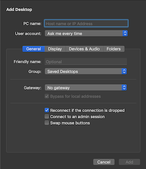
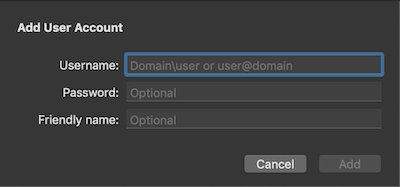
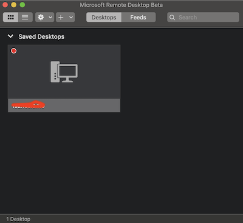
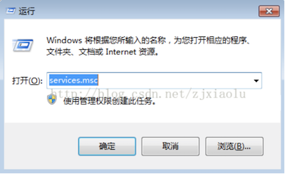
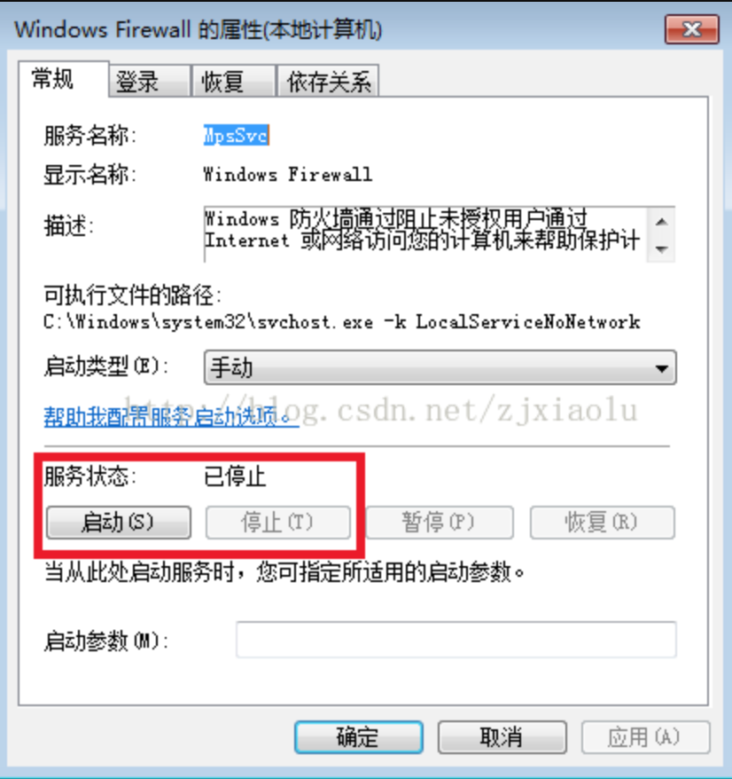

# 部署web项目到nginx服务器

nginx下载地址：
http://nginx.org/download/nginx-1.10.2.zip

## Mac远程连接windows桌面

Mac 下载远程桌面控制客户端 Microsoft Remote Desktop Beta <a href="https://rink.hockeyapp.net/apps/5e0c144289a51fca2d3bfa39ce7f2b06/">下载地址</a>

1、打开Microsoft Remote Desktop Beta ，点击上方 + 号，选择桌面Desktop,弹出如下



PC name里填写windows电脑的ip地址

2、User account 选择Add User Account，弹出如下



Username填写windows账户名称，password是相应的密码，点击Add；回到上一个界面继续点Add。

3、双击这个桌面，开始远程连接



## windows系统远程连接

1、打开windows系统电脑，在桌面“我的电脑”图标上点击右键，选择“属性”->“远程设置”。

    “远程协助”勾选“允许远程协助连接这台计算机”；

    “远程桌面”勾选“允许运行任意版本远程桌面的计算机连接”或者“仅允许运行使用网络级别用户”。

2、“控制面板”->“用户账户”，给将要作为被远程登录的windows系统电脑设置账户密码（已设置的忽略此项），不设置账户密码无法进行远程连接。

3、桌面左下角“开始"->“运行”，输入“cmd”,敲回车。

然后在弹出的黑色屏幕窗口中再输入“ipconfig”,敲回车。

在下面输出的内容找到ipv4对应的地址信息,如：192.168.1.255

4、看被远程计算机自带防火墙是否关闭，没有关闭关了就行（右键右下角的网络连接——打开防火墙设置）

快捷键Win+R，输入“services.msc”



双击：


关闭防火墙：



## ngix配置流程

1、进入项目目录，执行npm run build，开始构建项目

2、构建成功之后，会生成一个dist(build)文件夹（取决于你的项目配置），这个文件夹里的静态文件，就是我们的项目的访问文件了

3、远程连接服务器，安装nginx。

3、配置Nginx，Linux服务器是进入到：nginx/conf/nginx.conf，用记事本打开该文件：

```
// 当nginx捕获到访问域名为xxx.xxx.com的时候，就会转发到本地的80端口
server {
    listen       80;
    server_name  http://***.com; --写入自己的域名

    #charset koi8-r;

    #access_log  logs/host.access.log  main;

    location / {
        root   C:/Users/Administrator/Desktop/build;  ---项目的目录
        index  index.html index.htm;
        try_files $uri $uri/ /index.html; --使用了React-Router的browserHistory 模式需要加入的配置
    }

    #error_page  404              /404.html;

    # redirect server error pages to the static page /50x.html
    #
    error_page   500 502 503 504  /50x.html;
    location = /50x.html {
        root   html;
    }

    # proxy the PHP scripts to Apache listening on 127.0.0.1:80
    #
    #location ~ \.php$ {
    #    proxy_pass   http://127.0.0.1;
    #}

    # pass the PHP scripts to FastCGI server listening on 127.0.0.1:9000
    #
    #location ~ \.php$ {
    #    root           html;
    #    fastcgi_pass   127.0.0.1:9000;
    #    fastcgi_index  index.php;
    #    fastcgi_param  SCRIPT_FILENAME  /scripts$fastcgi_script_name;
    #    include        fastcgi_params;
    #}

    # deny access to .htaccess files, if Apache's document root
    # concurs with nginx's one
    #
    #location ~ /\.ht {
    #    deny  all;
    #}
}
```

参考资料：
    
1、https://www.jianshu.com/p/3a0470d13bcb
    
2、https://www.jianshu.com/p/f9f4a0d1ddd9

3、(react-router文档) https://react-guide.github.io/react-router-cn/docs/guides/basics/Histories.html

