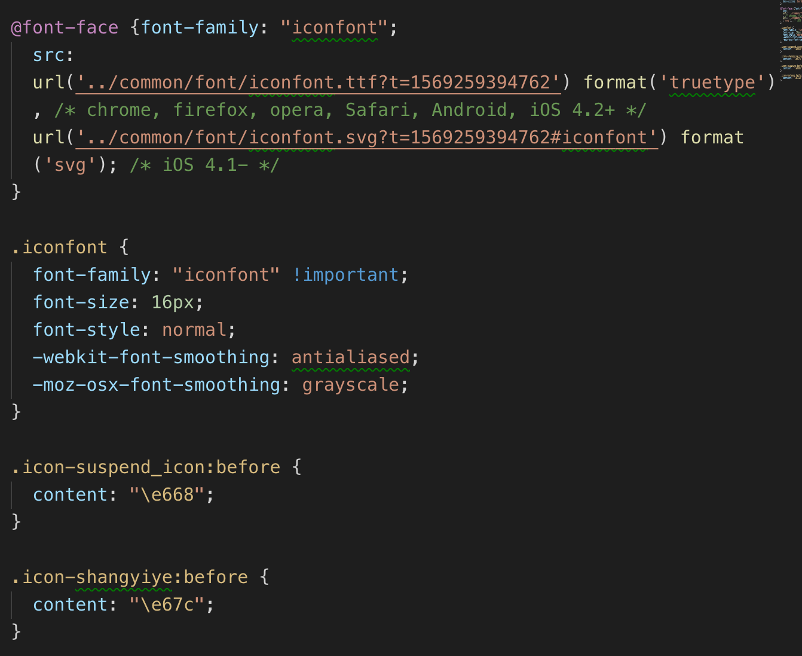

# 阿里矢量图标

<a href='https://www.iconfont.cn/'>网站链接</a>

1、用GitHub账号登录阿里

2、搜索图标，添加入库

3、找好所有图标后，选择'添加至项目'，加入项目，选择一个或者创建一个文件名

4、选择下载至本地

5、在项目中创建一个font文件夹放保存到本地阿里矢量图，并把 .svg 和 .ttf 结尾的文件放到font文件夹里

6、创建一个 .css 文件，把下载的阿里中 iconfont.css 的配置复制到新建的样式表里；

如下图：

7、使用图标
